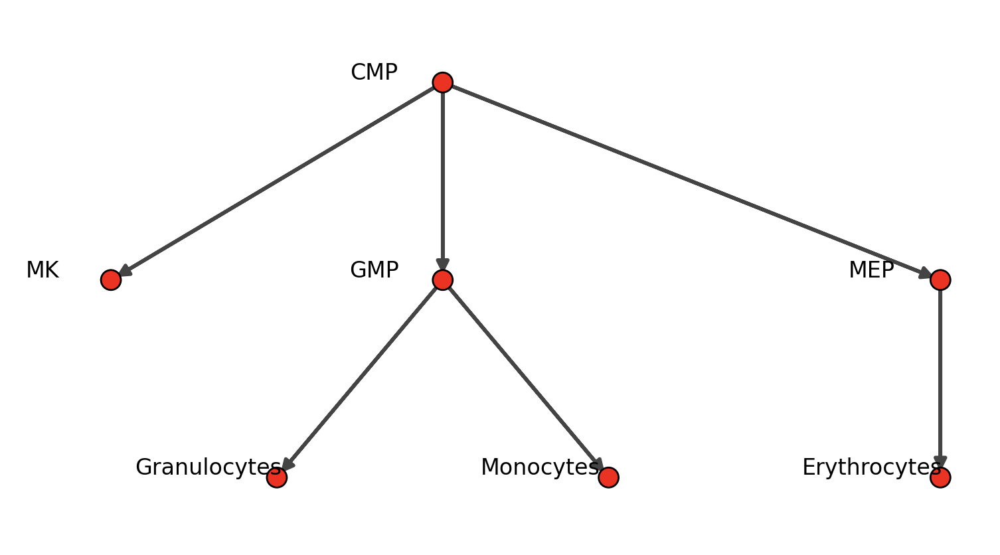
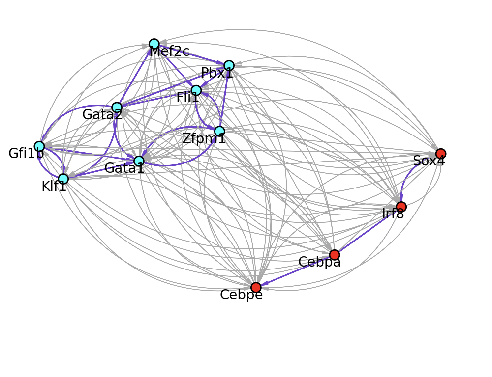
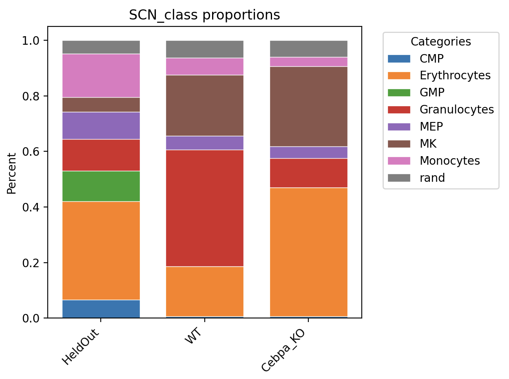

# OneSC (One Synthetic Cell) 

### <a name="introduction">Introduction</a>
OneSC is an computational tool for inferring and simulating core transcription factors circuits. 

Below is a walk-through tutorial on 
1. how to infer the transcription factors circuit
2. how to simulate synthetic single cell expression states across pseudotemporal trajectories using the circuit 

### Table of contents

[Installation](#installation) <br>

[Inference of GRN](#grn_inference) <br>

[Simulation of Synthetic Cells](#simulate_syncells) <br>

[Visualization of Simulated Cells](#visualize_simcells) <br>

[Perform Perturbation Simulation](#perturb_syncells) <br>

[Optional - Identification of dynamic TFs](#identify_dyntfs)

### <a name="installation">Installation</a>
We recommend creating a new conda environment (with python version >= 3.9) and install OneSC. Open terminal and type the following code. 
```
# type this into the terminal 
conda create -n OneSC_run python
conda activate OneSC_run 
```
In the conda environment, type the following code. 
```
# should be able to install onesc and the necessary dependencies. 
pip install git+https://github.com/CahanLab/oneSC.git@cscb24
```
### <a name="grn_inference">Inference of GRN</a>
In the tutorial, we are going to use the mouse myeloid single-cell data from [Paul et al, 2015](https://www.cell.com/cell/fulltext/S0092-8674(15)01493-2?_returnURL=https%3A%2F%2Flinkinghub.elsevier.com%2Fretrieve%2Fpii%2FS0092867415014932%3Fshowall%3Dtrue). You can download the [expression profiles of core transcription factors](https://cnobjects.s3.amazonaws.com/OneSC/Pual_2015/train_exp.csv) and the [sample table](https://cnobjects.s3.amazonaws.com/OneSC/Pual_2015/samp_tab.csv) with pusedotime and cluster information. 

Import the required packages. 
```
import numpy as np 
import pandas as pd 
import onesc 
import networkx as nx
import pickle 
import seaborn as sns
import matplotlib.pyplot as plt
import os
import scanpy as sc
import anndata
import scipy as sp
import pySingleCellNet as pySCN
from joblib import dump, load
import sys
import igraph as ig
from igraph import Graph
ig.config['plotting.backend'] = 'matplotlib'
```

Load in the training data. 
```
adata = sc.read_h5ad("Paul15_040824.h5ad")
```

We can use PySCN to help us annotate the states of the simulated cells. So train it now:
```
adata.obs['cell_types'].value_counts()


adTrain_rank, adHeldOut_rank = pySCN.splitCommonAnnData(adata, ncells=50,dLevel="cell_types")

clf = pySCN.train_rank_classifier(adTrain_rank, dLevel="cell_types")

pySCN.rank_classify(adHeldOut_rank, clf)
pySCN.heatmap_scores(adHeldOut_rank, groupby='SCN_class')
```


Define state transition graph
```
iinitial_clusters = ['CMP']
end_clusters = ['Erythrocytes', 'Granulocytes', 'Monocytes', 'MK']

state_path = onesc.construct_cluster_graph_adata(adata, initial_clusters = initial_clusters, terminal_clusters = end_clusters, cluster_col = "cell_types", pseudo_col = "dpt_pseudotime")

onesc.plot_state_graph(state_path)
```




You can also manually set the state path:
```
```python
edge_list = [("CMP", "MK"), ("CMP", "MEP"), ("MEP", "Erythrocytes"), ("CMP", "GMP"), ("GMP", "Granulocytes"), ("GMP", "Monocytes")]
H = nx.DiGraph(edge_list)
onesc.plot_state_graph(H)
```


Infer the GRN
```
iGRN = onesc.infer_grn(H, start_end_states, adata, num_generations = 20, max_iter = 30, num_parents_mating = 4, sol_per_pop = 30, reduce_auto_reg=True, ideal_edges = 0, GA_seed_list = [1, 3], init_pop_seed_list = [21, 25], cluster_col='cell_types', pseudoTime_col='dpt_pseudotime')

grn_ig = onesc.dataframe_to_igraph(iGRN)
onesc.plot_grn(grn_ig, layout_method='fr',community_first=True)
```



Define the start state
```
adCMP = adata[adata.obs['cell_types'] == 'CMP'].copy()
xstates = onesc.define_states_adata(adCMP, min_mean = 0.05, min_percent_cells = 0.20) * 2 
```


Set up for simulations
```
netsim = onesc.network_structure()
netsim.fit_grn(iGRN)
sim = onesc.OneSC_simulator()
sim.add_network_compilation('CMPdiff', netsim)
```


Simulate a trajectory of a 'wild-type' cell. This function has been tested on MacOS (m1 chip) and Ubuntu, it may or may not work on Windows. 
```
simlist_wt = onesc.simulate_parallel_adata(sim, xstates, 'CMPdiff', n_cores = 8, num_sim = 1000, t_interval = 0.1, noise_amp = 0.5)
```

Simulate a trajectory of a cell in which Cebpa is knocked out
```
perturb_dict = dict()
perturb_dict['Cebpa'] = -1 
simlist_cebpa_ko = onesc.simulate_parallel_adata(sim, xstates, 'CMPdiff', perturb_dict = perturb_dict, n_cores = 8, num_sim = 1000, t_interval = 0.1, noise_amp = 0.5)
```

Now fetch the simulated cells, sampling from the end stages, classify them, and visualize the results.
```
ad_wt = onesc.sample_and_compile_anndatas(simlist_wt, X=50, time_bin=(80, 100), sequential_order_column='sim_time')

ad_cebpa_ko = onesc.sample_and_compile_anndatas(simlist_cebpa_ko, X=50, time_bin=(80, 100), sequential_order_column='sim_time')

pySCN.rank_classify(ad_wt, clf)
pySCN.rank_classify(ad_cebpa_ko, clf)

pySCN.plot_cell_type_proportions([adHeldOut_rank,ad_wt, ad_cebpa_ko], obs_column = "SCN_class", labels=["HeldOut", "WT","Cebpa_KO"])
```



### <a name="identify_dyntfs">Optional - Identification of dynamic TFs</a>
OneSC also has a built-in function that allows the user to identify important dynamically expressed transcription factors for the downstream GRN inference. This method was an adaptation from [Su et al, 2022](https://www.sciencedirect.com/science/article/pii/S2213671121006573?via%3Dihub). If the user knows the key transcription factors important for development in the biological system of interest, then feel free to use those genes and skip this step. 

First download the processed and cell-typed anndata of [Paul et al dataset](https://cnobjects.s3.amazonaws.com/OneSC/Pual_2015/filtered_adata.h5ad) and [mouse TFs list](https://cnobjects.s3.amazonaws.com/OneSC/mmTFs/Mus_musculus_TF.txt). The list of mouse TFs were downloaded from [Animal TFDB v4.0](https://guolab.wchscu.cn/AnimalTFDB4/#/) ([Shen et al, 2023](https://academic.oup.com/nar/article/51/D1/D39/6765312?login=true)). To see the scanpy workflow of preprocessing, clustering and cell typing the data, please see [this file](https://cnobjects.s3.amazonaws.com/OneSC/preprocessing_scripts/celltype_myeloid.py). 

First load in the mouse transcription factors and the cell-type annotated anndata. 
```
import numpy as np 
import pandas as pd
import onesc 
import scanpy as sc

# load in the mouse TFs and anndata
mmTFs = pd.read_csv("Mus_musculus_TF.txt", sep = '\t')
mmTFs_list = list(mmTFs['Symbol'])
test_adata = sc.read_h5ad("filtered_adata.h5ad")
```
Extract out the sample table and expression profiles. 

```
samp_tab = test_adata.obs
exp_tab = test_adata.raw.to_adata().to_df()
exp_tab = exp_tab.T
```
Identify the different trajectories in the single-cell data. 
```
trajectory_dict = dict()
trajectory_dict['T1'] = ['CMP', 'MEP', 'Erythrocytes']
trajectory_dict['T2'] = ['CMP', 'GMP', 'Granulocytes']
trajectory_dict['T3'] = ['CMP', 'GMP', 'Monocytes']
trajectory_dict['T4'] = ['CMP', 'MK']

```
Indicate the column name for the clusters/cell type information and pseudotime ordering. 
```
cluster_col = 'cell_types'
pt_col = 'dpt_pseudotime'

my_df = onesc.suggest_dynamic_genes(exp_tab.loc[exp_tab.index.isin(mmTFs_list), :].copy(), samp_tab, trajectory_dict, cluster_col, pt_col, adj_p_cutoff = 0.05, log2_change_cutoff = 3, min_exp_cutoff = 0.4)
interesting_TFs = np.unique(my_df.index)
print(interesting_TFs)
# ['Cebpa' 'Cebpe' 'Fli1' 'Gata1' 'Gata2' 'Gfi1b' 'Irf8' 'Klf1' 'Mef2c'
 'Pbx1' 'Sox4' 'Zfpm1']
```